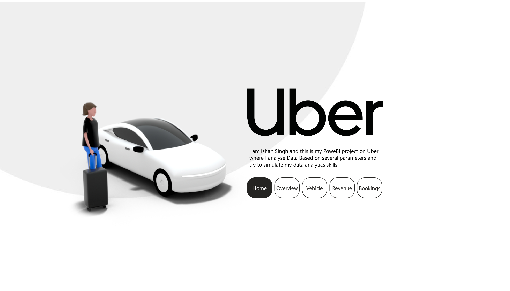
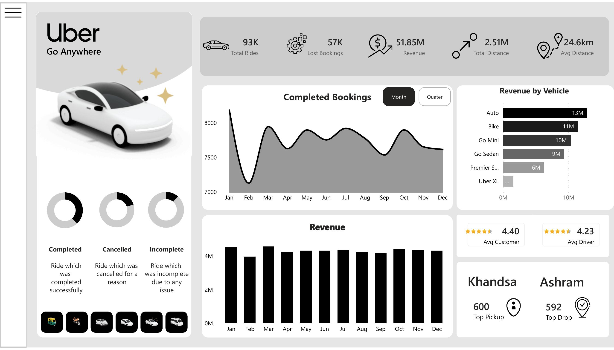
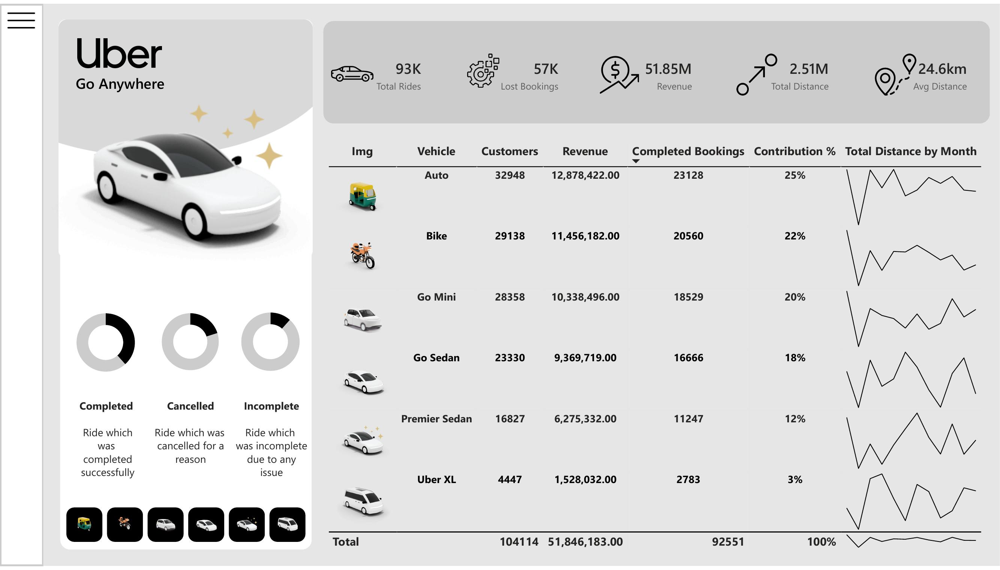
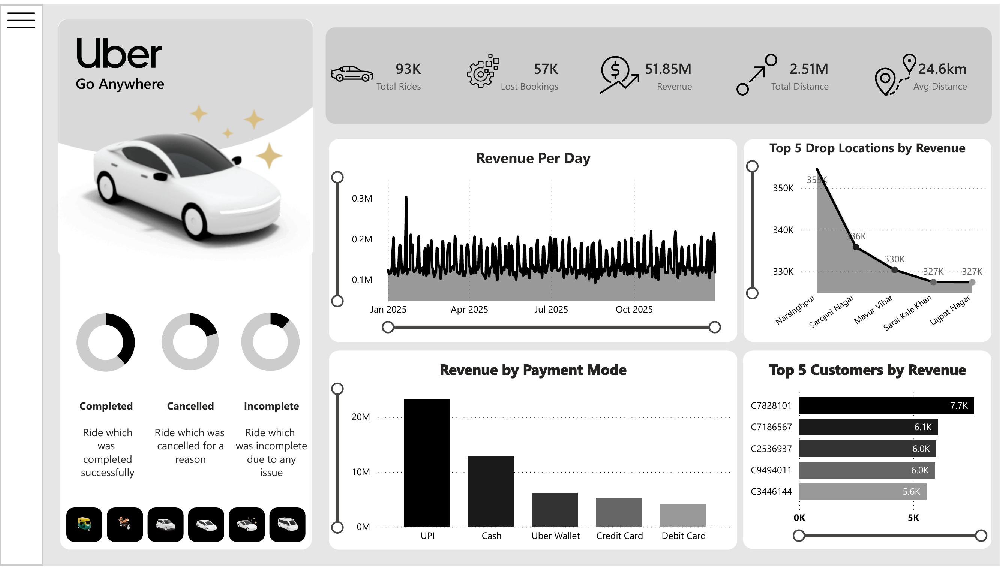
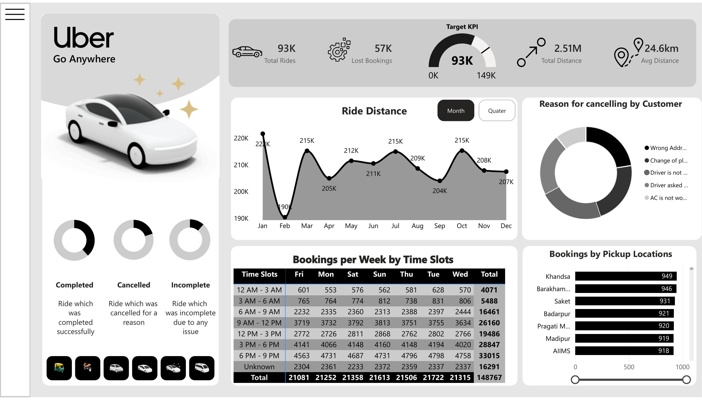

# 🚗 Uber Ride Analytics   Power BI Dashboard

**A 5-page, multi-vehicle operations & revenue intelligence dashboard built on 150,000+ Uber ride records.**

Author: **Aayush Srivastava** · Tool: Power BI Desktop · Data: Uber ride-booking dataset (Kaggle-style, 150K rows)


---

## Project Overview

Ride-hailing operations generate three kinds of pain for the business teams that run them: **bookings that never convert into revenue**, **fleets that perform unevenly across vehicle types**, and **demand that clusters unpredictably by time and location**. Raw trip logs don't answer *"which vehicle type is underperforming,"* *"where are we losing money to cancellations,"* or *"when should we surge drivers"*  someone has to model and visualize that data first.

This project turns a raw 150,000-row Uber ride log into a **decision-ready Power BI report** that a city operations manager, revenue analyst, or driver-supply planner could actually use day-to-day. It was built to simulate a real BI engagement end-to-end: sourcing messy transactional data, modeling it in Power Query, writing DAX measures for the metrics that matter, and designing an interactive, multi-page report rather than a single static chart-dump.

**Business questions the dashboard answers:**
- How many bookings convert to completed rides vs. get lost to cancellations or no-driver-found?
- Which vehicle type drives the most revenue, and which is the weakest contributor?
- Where is demand concentrated  which pickup/drop zones and which hours of the day?
- Who are the highest-value customers, and which locations generate the most revenue?
- Why are customers cancelling, and can that be reduced operationally?

---

## Key Insights & KPIs

**Headline numbers** (FY dataset, 150,000 bookings):

| Metric | Value |
|---|---|
| Total Bookings | **150,000** |
| Completed Bookings | **93,000** (62%) |
| Lost Bookings (cancelled / no driver / incomplete) | **57,000** (38%) |
| Total Revenue | **₹47.26M – 51.85M** *(scope-dependent, see note below)* |
| Total Distance Travelled | **2.51M km** |
| Avg. Distance per Ride | **24.6 km** |
| Avg. Customer Rating | **4.40 / 5** |
| Avg. Driver Rating | **4.23 / 5** |

> Revenue is reported at two scopes in the deck: **₹47.26M** reflects completed-ride booking value only, while **₹51.85M** on the KPI strip includes incomplete trips with a partial fare captured. Both are intentional   the report lets you toggle between an "operations" view (completed-only) and a "gross" view depending on the audience.

**What the data shows:**
- **Auto and Bike lead the fleet mix**   together contributing ~47% of completed bookings and revenue, while **Uber XL is the long tail** at just 3% of contribution despite being the highest-value per-ride vehicle type.
- **UPI dominates payments** at ~45% of revenue, more than 3× Cash   a strong signal for where to invest in payment-partner reliability.
- **6 PM–9 PM is the busiest slot** every day of the week (~33K bookings), making it the clearest signal for driver-supply incentives.
- **Khandsa and Ashram are the top pickup/drop nodes**, with a fairly even spread across the next five zones   demand is distributed, not concentrated in one hotspot.
- **"Wrong Address" and "Change of Plans" are the top two customer-cancellation reasons**, both of which are addressable through better address confirmation UX rather than driver-side fixes.
- Revenue per day is volatile but stable in range (₹0.1M–0.3M), with no strong seasonal trend across the year   growth looks driven by volume, not seasonality.

---

## Visualizations Breakdown

### 1 · Home / Landing Page
Cover page framing the project, author, and page navigation.



### 2 · Overview Page
The executive summary: top-line KPIs (Completed Bookings, Lost Bookings, Revenue, Total Distance, Avg Distance), a Completed Bookings trend (month/quarter toggle), a monthly Revenue bar chart, Revenue by Vehicle Type, Top Pickup/Drop locations, Avg. Customer/Driver rating, and the three-ring Completed / Cancelled / Incomplete breakdown.



### 3 · Vehicle Page
A vehicle-level performance table   image, distinct customers, revenue, completed bookings, contribution %, and a per-vehicle distance sparkline   so any single vehicle type's health can be read at a glance.



### 4 · Revenue Page
Revenue-focused deep dive: Revenue per day (with a date-range slicer), Revenue by Payment Mode, Top 5 Drop Locations by Revenue, and Top 5 Customers by Revenue.



### 5 · Bookings Page
Operational drill-down: Ride Distance per month/quarter, Reason for Customer Cancellation (donut), Bookings by Pickup Location, a Bookings-per-Week-by-Time-Slot matrix, and a Target KPI gauge tracking bookings against a set goal.



---

## Tech Stack

- **Power BI Desktop**   report authoring, data modeling, page navigation
- **Power Query (M)**   data cleaning, column typing, calendar table generation, unpivoting time-slot data
- **DAX**   all KPIs, ratios, and time-intelligence measures
- **Data source**   Uber ride-booking transactional log (~150,000 rows: booking status, vehicle type, fare, distance, ratings, payment method, pickup/drop location, timestamps)

**Core DAX measures used across the report:**

```dax
Completed Bookings =
CALCULATE(
    COUNTROWS(Bookings),
    Bookings[Booking Status] = "Completed"
)
```

```dax
Lost Bookings =
CALCULATE(
    COUNTROWS(Bookings),
    Bookings[Booking Status] <> "Completed"
)
```

```dax
Revenue =
SUM(Bookings[Booking Value])
```

```dax
Total Distance =
SUM(Bookings[Ride Distance])
```

```dax
Avg Distance =
AVERAGE(Bookings[Ride Distance])
```

```dax
Distinct Customers =
DISTINCTCOUNT(Bookings[Customer ID])
```

```dax
Contribution % =
DIVIDE(
    [Revenue],
    CALCULATE([Revenue], ALL(Bookings[Vehicle Type]))
)
```

```dax
Bookings per Quarter =
CALCULATE(
    COUNTROWS(Bookings),
    DATESQTD('Calendar'[Date])
)
```

```dax
Target Bookings KPI =
VAR Target = 149000
RETURN
DIVIDE([Completed Bookings], Target)
```

---

## How to Interact

- **Page navigation**   the pill-style nav bar (Home · Overview · Vehicle · Revenue · Bookings) on the landing page and the left sidebar icons on every report page switch between the five views.
- **Vehicle filter**   present on the Overview and Vehicle pages; slice every KPI, chart, and table by a single vehicle type (Auto, Bike, Go Mini, Go Sedan, Premier Sedan, Uber XL) or view them unfiltered.
- **Month / Quarter toggle**   on the Overview (Completed Bookings) and Bookings (Ride Distance) pages, switches the time granularity of the trend line without changing the visual.
- **Date-range slider**   on the Revenue page, drag either handle under "Revenue per Day" to scope the daily revenue trend and the two Top-5 tables to a custom window.
- **Drill-down tables**   the Vehicle page table and the Bookings-per-Week-by-Time-Slot matrix support Power BI's native drill-down/expand to inspect individual cells.
- **Cross-filtering**   clicking any bar, donut segment, or table row (e.g., a vehicle type, a payment method, a cancellation reason) cross-filters every other visual on that page, standard Power BI report interaction behavior.

---

*Built as a self-directed Power BI practice project to demonstrate end-to-end BI workflow: data modeling, DAX measure design, and multi-page interactive report building.*
